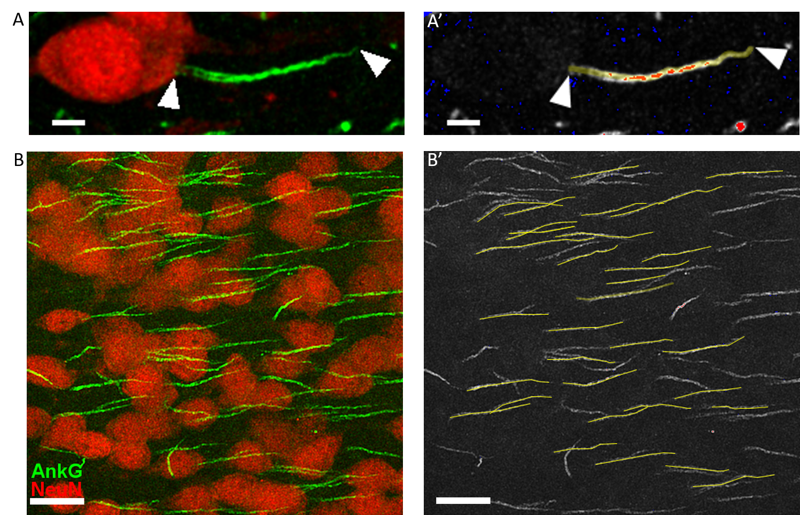

# Project Overview:

The data for the two notebooks in this folder looks at measurements of the Axon Initial Segment (AIS) length. 

Data collection was undertaken during my PhD and a represenations of raw images and measurement collection are show in the image below. Panels A' and B' panel show AIS traces measured from raw images A & B.

- ### [Project 1:](AIS_files/AIS_Multiple_models_new.ipynb)
          - Compares the effects of different genetic mutations implicated in autism spectrum disorder on the AIS length
- ### [Project 2:](https://github.com/shinnapinna/data_science_portfolio/blob/f21f4adf0116efee63b0b67d6dc0bb5cdcf48f70/AIS_files/AIS_GLMM_new.ipynb)
          - Runs a statistical comparison of the effect of the same genetic mutation across different brain regions.
